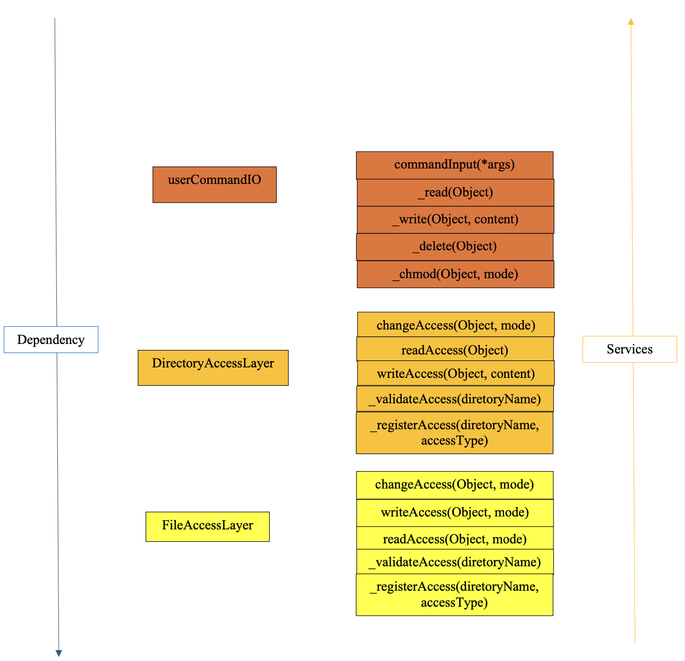
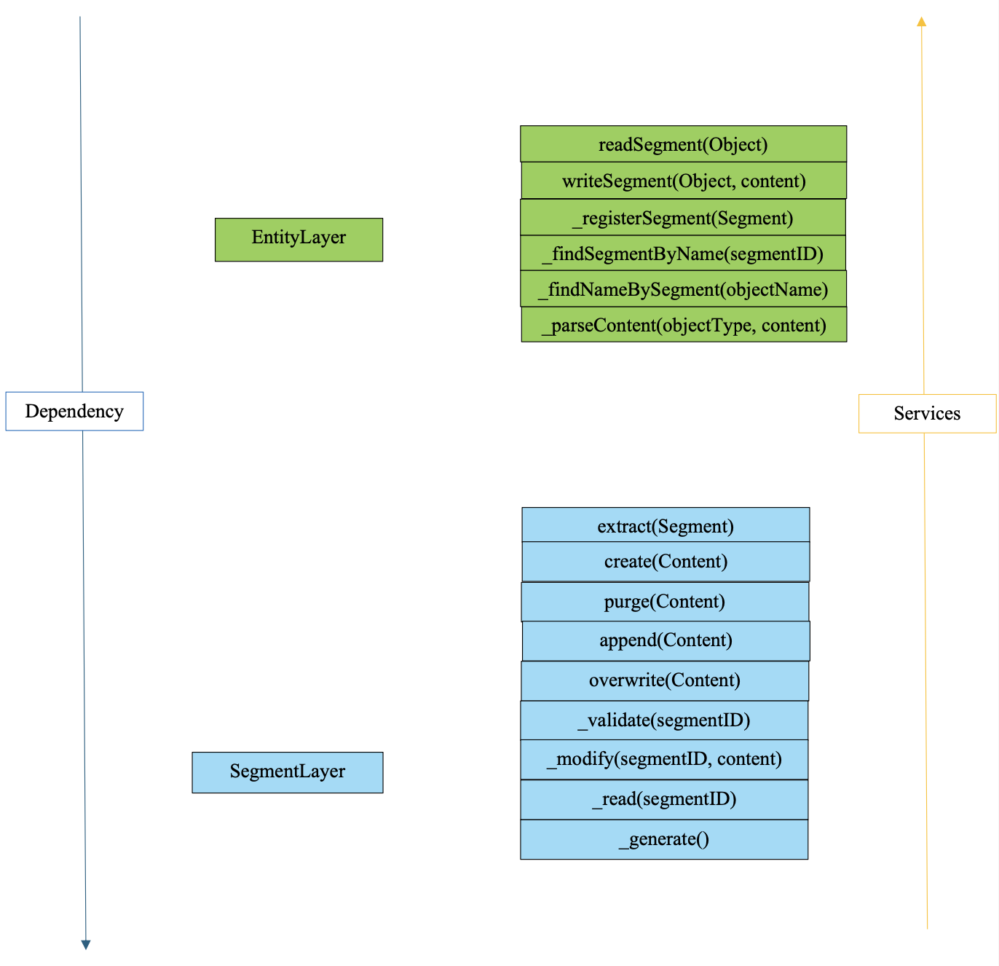

# Secure File System

A modular implementation of a secure file system with Discretionary Access Control (DAC) and Mandatory Access Control (MAC) policies.

## Overview

The system uses a layered architecture with well-defined interfaces between modules:

### System Architecture






1. **UserCommandIO Layer**
   - Parses user commands
   - Routes operations to appropriate access layers
   - Handles command validation

2. **DirectoryAccessLayer**
   - Manages directory permissions
   - Enforces directory-level DAC
   - Coordinates with FileAccessLayer

3. **FileAccessLayer**  
   - Manages file permissions
   - Enforces file-level DAC
   - Interfaces with EntityLayer

4. **EntityLayer**
   - Maps between names and segment addresses
   - Handles translation of operations
   - Coordinates with SegmentLayer

5. **SegmentLayer**
   - Low-level storage operations
   - Enforces MAC policy
   - Manages segment allocation

## Features

- Hierarchical file system structure with files and directories
- Two-level access control:
  - DAC (Discretionary Access Control) at directory and file levels
  - MAC (Mandatory Access Control) at segment level for essential system files
- Read/write permissions can be modified independently
- Support for file operations: create, read, write, append, delete
- Directory operations: create, list contents, delete

## Requirements

- Python 3.11.5 or higher


## Usage

### Command Format
```
<operation> <object_type> <path> [content]
```

Where:
- `operation`: read, write, or chmod
- `object_type`: file or directory  
- `path`: full path to target file/directory
- `content`: required for write operations

### Examples

Create a directory:
```
write directory /root/dir1 ""
```

Create a file with content:
```
write file /root/dir1/file1 "Hello World!"
```

Read a file:
```
read file /root/dir1/file1
```

Modify permissions (chmod):
```
chmod file /root/dir1/file1 3
```

Permission modes:
- 0: No read, no write
- 1: No read, yes write  
- 2: Yes read, no write
- 3: Yes read, yes write

Special write operations:
- Append: Add `/+` prefix to content
- Delete: Use `/delete` as content

## Project Structure

- `Main.py`: Main execution file with testing functionality
- `Handles.py`: Handle classes for Object, Segment, Content, Result
- `User_command_io.py`: Command parsing and execution
- `Directory_access_layer.py`: Directory access control implementation
- `File_access_layer.py`: File access control implementation  
- `Entity_layer.py`: Name-to-segment address translation
- `Segment_layer.py`: Low-level storage and MAC implementation


## Security Features

### Access Control

- **DAC Implementation**
  - Per-directory and per-file permissions
  - Independent read/write controls
  - Permission inheritance for new files/directories
  
- **MAC Implementation**
  - Immutable segment access table
  - Protection of essential system segments
  - Mandatory read/write restrictions

### Information Hiding

- Segment addresses not exposed to upper layers
- Directory/file abstractions maintained
- Internal implementation details encapsulated

## Error Handling

Common error messages:

- "Invalid Operation": Unrecognized command or format
- "Access Denied": Insufficient permissions
- "Cannot Read/Write Non-Exist Entity": Target doesn't exist
- "Cannot Create under Non-Exists Directory": Parent path invalid

## Testing

The system includes two testing modes:

1. **Static Testing**
   - Predefined test cases in `Main.py`
   - Can be modified for specific scenarios
   
2. **Interactive Testing**  
   - Command prompt interface
   - Real-time command execution
   - Enter 'exit' to quit

## Limitations

- Limited to "read" and "write" permissions
- No synchronization for shared file access
- No secondary storage implementation
- No system initialization configuration